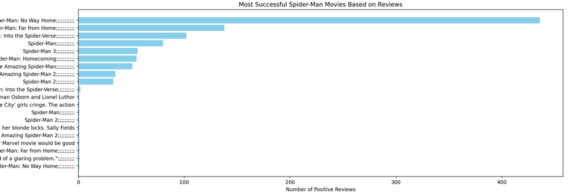

# Spider-Man Reviews Analysis

## Постановка задачи

Цель данного проекта - проанализировать отзывы на фильмы о "Человеке-пауке" и определить наиболее успешные фильмы по мнению пользователей. Для достижения этой цели выполнены следующие шаги:

1. Загрузка данных из CSV файла.
2. Фильтрация нужных столбцов.
3. Удаление дубликатов и пустых значений.
4. Фильтрация положительных отзывов и отзывов, содержащих более 40 слов.
5. Очистка текста отзывов от заданных слов.
6. Построение графика для визуализации успешности фильмов.

В работе использован датасет ["Spider-Man Movies IMDB Reviews"](https://www.kaggle.com/datasets/okancan/spiderman-movies-imdb-reviews), в частности, следующие столбцы:
- Rating (float)
- Title (str)
- Date (date)
- Review (str)
- Movie (str)

## Используемые технологии

### PySpark

- **PySpark** - это библиотека для обработки больших данных с помощью Apache Spark на языке Python. В данном проекте PySpark используется для загрузки, обработки и фильтрации данных.

#### Основные функции PySpark, используемые в проекте:

- `SparkSession` - создание сессии Spark.
- `read.csv` - загрузка данных из CSV файла.
- `select` - выбор нужных столбцов.
- `withColumnRenamed` - переименование столбцов.
- `filter` - фильтрация данных.
- `udf` - создание пользовательских функций для использования в Spark DataFrame.
- `groupBy` и `count` - группировка данных и подсчет количества записей.

### Matplotlib

- **Matplotlib** - библиотека для создания графиков и визуализаций в Python. В данном проекте Matplotlib используется для построения графика успешности фильмов.

#### Основные функции Matplotlib, используемые в проекте:

- `plt.figure` - создание новой фигуры.
- `plt.barh` - создание горизонтального столбчатого графика.
- `plt.xlabel` и `plt.title` - добавление меток и заголовка.
- `plt.gca().invert_yaxis()` - инверсия оси y для лучшего восприятия графика.
## Запуск проекта
1.	Установите необходимые библиотеки:

>pip install pyspark matplotlib pandas

2.	Запустите скрипт:

>python spider_man_reviews.py

Этот проект позволяет проанализировать отзывы на фильмы "Человек-паук" и определить наиболее успешные фильмы по мнению пользователей, предоставляя графическое представление полученных данных.

## Витрина данных

## Графическое представление

